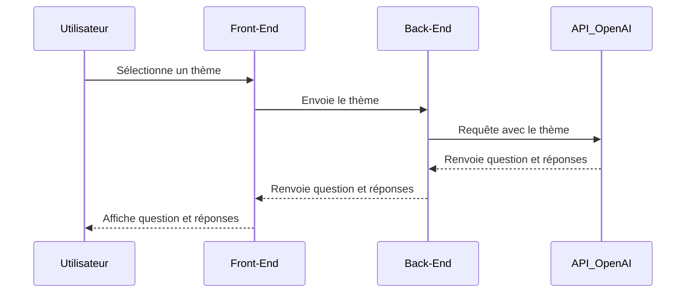
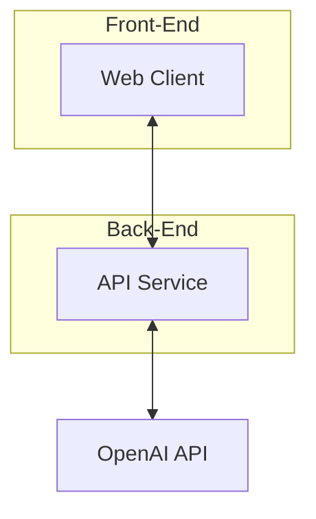

```mermaid
sequenceDiagram
    participant Utilisateur
    participant Front-End
    participant Back-End
    participant API_OpenAI

    Utilisateur->>Front-End: Sélectionne un thème
    Front-End->>Back-End: Envoie le thème
    Back-End->>API_OpenAI: Requête avec le thème
    API_OpenAI-->>Back-End: Renvoie question et réponses
    Back-End-->>Front-End: Renvoie question et réponses
    Front-End-->>Utilisateur: Affiche question et réponses

```

```mermaid
flowchart TD
    subgraph Front-End
        Web[Web Client]
    end

    subgraph Back-End
        API[API Service]
    end

    OpenAI[OpenAI API]

    Web <--> API
    API <--> OpenAI
```