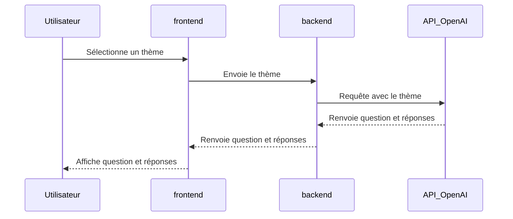
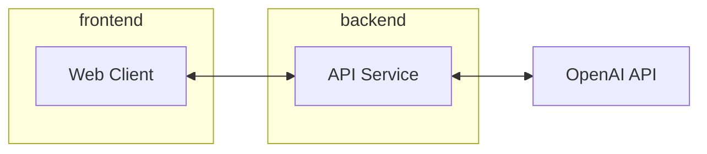

# Quiz en Ligne ❓

Un projet de **quiz** **interactif** en ligne qui génère des questions à partir d'un thème choisi par l'utilisateur. Le système s'appuie sur une communication fluide entre un frontend, un backend et l'API **OpenAI** pour proposer des expériences enrichissantes.

## Fonctionnalités ⚙️

- **Choix de thème :** Les utilisateurs peuvent choisir un thème de leur choix.
- **Questions générées automatiquement :** Le backend communique avec OpenAI pour créer des questions pertinentes.
- **Expérience utilisateur :** Les questions et les réponses sont affichées de manière dynamique sur l'interface.

---

## Flux de Communication 💬

Le processus se déroule comme suit :

1. L'utilisateur sélectionne un thème dans l'interface *frontend*.
2. Le *frontend* transmet le thème au *backend*.
3. Le *backend* utilise l'API **OpenAI** pour générer une question et plusieurs réponses.
4. Le *backend* renvoie les données au *frontend*.
5. Le *frontend* affiche la question et les réponses à l'utilisateur.

### Diagramme de Séquence 🎞️



---

## Architecture 👷

L'application est divisée en trois principaux composants : le *frontend*, le *backend*, et le service **OpenAI**. 

### Schéma d'Architecture 🏗️



---

## Technologies Utilisées 🖥️

- **frontend :** React **Rescript** pour une expérience utilisateur dynamique.
- **backend :** **Rescript** avec Express pour gérer les API et la logique métier.
- **API OpenAI :** Utilisation de modèles GPT pour générer du contenu pertinent.

---

## Installation 🚚

1. Clonez ce dépôt :
   ```bash
   git clone https://github.com/Nairod36/ReScript-Project
   cd Rescript-Project
   ```

2. Installez les dépendances pour le backend :
   ```bash
   cd backend
   npm install
   ```

3. Configurez la clé API OpenAI dans le fichier `src/service/openAIService.res`

4. Compilez le projet backend :
    ```bash
    npm run res:build
    ```

5. Ajoutez le middleware `cors` dans le fichier`src/App.res.mjs`
```js
import cors from "cors";

// Configuration CORS
const corsOptions = {
      origin: "http://localhost:3000",
      methods: ["GET", "POST"]
  };
  app.use(cors(corsOptions));
```

6. Démarrer l'API :
   ```bash
   npm run api
   ```

7. Installez les dépendances pour le frontend :
```bash
cd ../frontend
npm install
```

8. Compilez le projet frontend :
```bash
npm run res:build
```

9. Démarrez le frontend :
```bash
npm run dev
```

---
